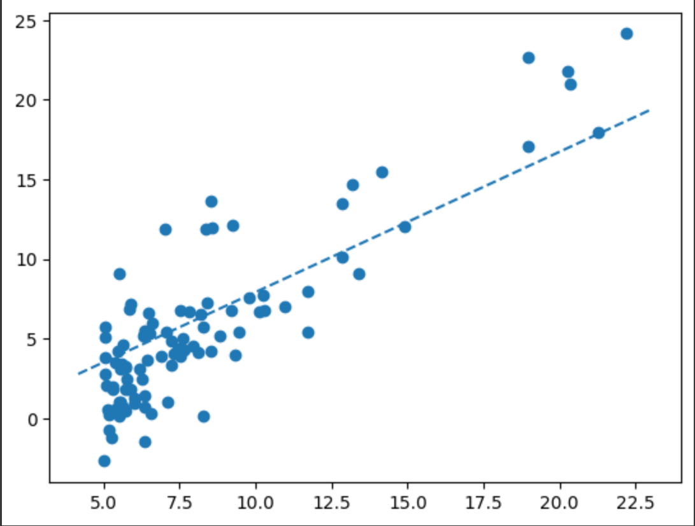

# ML - HPX

This repository contains my attempts to parallelize ML algorithms, starting with linear regression, using the HPX C++ library

### Results 

Sequential execution, without any attempts to parallelize it, gave decent linear function fitting the dataset, named random1 in the `datasets` folder

```cpp
for (int k=0; k<N; k++) {  
    float dj_dw = 0, dj_db = 0;
    float J = 0;
    for (int i=0; i<n; i++) {
        J += (f(X[i], W, B) - Y[i]) * (f(X[i], W, B) - Y[i]) ;
        dj_dw += (f(X[i], W, B) - Y[i]) * X[i];
        dj_db += (f(X[i], W, B) - Y[i]);
    }
    J /= (n * 2);
    dj_dw /= n;
    dj_db /= n;

    prev_W = W;
    prev_B = B;

    W -= alpha * dj_dw;
    B -= alpha * dj_dw;
}
```



And now we see how long it takes to execute the model

```sh
$ ./linear_reg ../datasets/random1.csv 
Final Parameters: W = 0.767133, B = 0.255443
Elapsed time: 0.002966 [s]

$ ./linear_reg ../datasets/random1.csv 
Final Parameters: W = 0.813219, B = -0.205705
Elapsed time: 0.003122 [s]

$ ./linear_reg ../datasets/random1.csv 
Final Parameters: W = 0.823522, B = -0.308800
Elapsed time: 0.002654 [s]
```

Now, these are my steps to parallelize it

1. Using `hpx::experimental::for_loop`, 

```cpp
for (int k=0; k<N; k++) {  
    float dj_dw = 0, dj_db = 0;
    
    hpx::experimental::for_loop(hpx::execution::par, 0, n, [&](auto i) {
        dj_dw += (f(X[i], W, B) - Y[i]) * X[i];
        dj_db += (f(X[i], W, B) - Y[i]);
    });


    dj_dw /= n;
    dj_db /= n;

    prev_W = W;
    prev_B = B;

    W -= alpha * dj_dw;
    B -= alpha * dj_dw;
}

```

But this actually has more compilation time than expected. 

```sh
$ ./linear_reg ../datasets/random1.csv 
Final Parameters: W = 0.601210, B = 2.026218
Elapsed time: 0.021923 [s]

$ ./linear_reg ../datasets/random1.csv 
Final Parameters: W = 0.697301, B = 1.118010
Elapsed time: 0.038696 [s]

$ ./linear_reg ../datasets/random1.csv 
Final Parameters: W = 0.710964, B = 1.004072
Elapsed time: 0.050179 [s]
```

I believe its due to the following reasons

- Dependency between each iteration, i.e., the derivatives
- Since dataset is large, parallelizing for such large number of data points adds overhead than actually improving performance

### Future work

I will explore HPX library and its functionality further, so I can hopefully improve the performance, and look into the above result(s) as well
