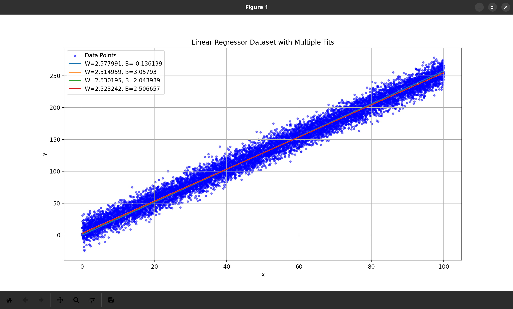

# ML - HPX

Implementation of common ML algorithms from scratch in C++, utilisng HPX as the runtime and providing bindings for them in Python using Nanobind.

## Build Instructions
Pre-requisites: [Installing HPX](https://hpx-docs.stellar-group.org/latest/html/quickstart.html)

```sh
cd build
git clone https://github.com/vrnimje/ml-hpx.git

cd ml-hpx
pip install .
```

### Utilising the bindings

1. Linear Regression

[Script](./python_tests/lin_reg.py):

```py
from ml_hpx import LinearRegression
import pandas as pd

df = pd.read_csv('./datasets/linear_regressor_dataset_10000.csv')
X = df['x']
Y = df['y']

data = list(zip(X, Y))

lin_reg = LinearRegression(5000, 1e-5)

print(lin_reg.fit(data))
print(lin_reg.predict(79.8690852138018))
```

```sh
(env) $ python python_tests/lin_reg.py
ML-HPX Linear Regression MSE: 105.4234
ML-HPX Linear Regression Time: 0.0534 seconds
Sklearn Linear Regression MSE: 99.7971
Sklearn Linear Regression Time: 0.0054 seconds
```

2. Logistic Regression

[Script](./python_tests/log_reg.py):

```py
from ml_hpx import LogisticRegression
import pandas as pd
from sklearn.model_selection import train_test_split
from sklearn.metrics import accuracy_score
import sklearn.linear_model
from sklearn.preprocessing import StandardScaler

df = pd.read_csv('./datasets/logistic_regression_dataset_10000.csv')

X = df[['x']]
y = df['class']

# Split the data into training and testing sets
X_train, X_test, y_train, y_test = train_test_split(X, y, test_size=0.2)

scaler = StandardScaler()
X_train = scaler.fit_transform(X_train)
X_test = scaler.transform(X_test)

train = list(zip(X_train.flatten().tolist(), y_train))

log_reg = LogisticRegression(5000, 0.005, 123)
print(f"Train accuracy: {log_reg.fit(train)}")

y_pred = log_reg.predict(X_test.flatten().tolist())

# Evaluate the model
print("Test accuracy:", accuracy_score(y_test, y_pred))

# Create and fit the logistic regression model
model = sklearn.linear_model.LogisticRegression()
model.fit(X_train, y_train)

# Predict on the test set
y_pred = model.predict(X_test)

# Evaluate the model
print("Accuracy:", accuracy_score(y_test, y_pred))
```

```sh
(env) $ python python_tests/log_reg.py
ML-HPX Logistic Regression accuracy: 0.9770
ML-HPX Logistic Regression time: 0.2139 seconds
Sklearn Logistic Regression accuracy: 0.9765
Sklearn Logistic Regression time: 0.0224 seconds
```

3. K-Nearest Neighbours classifier

[Script](./python_tests/knn.py):

```py
from ml_hpx import KNearestNeighbours
from sklearn.neighbors import KNeighborsClassifier
from sklearn.model_selection import train_test_split
from sklearn.metrics import accuracy_score
from sklearn.preprocessing import StandardScaler
import pandas as pd

df = pd.read_csv('./datasets/classified_points_dataset.csv')

X = df[['x', 'y']]
y = df['class']

# Split the data into training and testing sets
X_train, X_test, y_train, y_test = train_test_split(X, y, test_size=0.2)

scaler = StandardScaler()
X_train = scaler.fit_transform(X_train)
X_test = scaler.transform(X_test)

knn = KNearestNeighbours(k=3)

knn.fit(X_train.tolist(), y_train.values)

y_pred = knn.predict(X_test.tolist())

print("ML-HPX accuracy", accuracy_score(y_pred, y_test))

knn_sklearn = KNeighborsClassifier(n_neighbors=3)

knn_sklearn.fit(X_train, y_train)

y_pred = knn.predict(X_test)

print("Sklearn accuracy", accuracy_score(y_pred, y_test))
```

```sh
(env) $ python python_tests/knn.py
ML-HPX accuracy: 1.0000
ML-HPX time: 0.1780 seconds
Sklearn accuracy: 1.0000
Sklearn time: 0.0090 seconds
```

4. k-Means Clustering

[Script](./python_tests/kmeans.py):

```py
from ml_hpx import KMeansClustering
from sklearn.cluster import KMeans
from sklearn.preprocessing import StandardScaler
import pandas as pd
from time import perf_counter

# Load dataset
df = pd.read_csv('./datasets/kmeans_test_dataset.csv')

X = df[['x', 'y']]

# Standardize features
scaler = StandardScaler()
X_scaled = scaler.fit_transform(X)

### scikit-learn KMeans ###
k = 5
kmeans = KMeans(n_clusters=k, random_state=42)

start_kmeans = perf_counter()
kmeans.fit(X_scaled)
end_kmeans = perf_counter()

# Add cluster labels to DataFrame
df['cluster'] = kmeans.labels_

# Print performance
print(f"Sklearn KMeans time: {end_kmeans - start_kmeans:.4f} seconds")
print(f"Inertia: {kmeans.inertia_:.4f}")

kmeans_hpx = KMeansClustering(k=5)

start_hpx = perf_counter()
sse = kmeans_hpx.fit(X_scaled.tolist())
end_hpx = perf_counter()

print(f"ML-HPX KMeans time: {end_hpx - start_hpx:.4f} seconds")
print(f"Inertia: {sse:.4f}")
```

```sh
(env) $ python python_tests/kmeans.py
Sklearn KMeans time: 0.0140 seconds
Inertia: 543.3955
ML-HPX KMeans time: 0.0085 seconds
Inertia: 543.3952
```

5. Perceptron classifier

[Script](./python_tests/perceptron.py):

```py
from ml_hpx import Perceptron
import pandas as pd
from sklearn.model_selection import train_test_split
from sklearn.metrics import accuracy_score
from sklearn.linear_model import Perceptron as SklearnPerceptron
from sklearn.preprocessing import StandardScaler
from time import perf_counter

# Load data
df = pd.read_csv('./datasets/logistic_regression_dataset_10000.csv')
X = df[['x']]
y = df['class']

# Split the data into training and testing sets
X_train, X_test, y_train, y_test = train_test_split(X, y, test_size=0.2)

# Standardize features
scaler = StandardScaler()
X_train = scaler.fit_transform(X_train)
X_test = scaler.transform(X_test)

X_train_flat = X_train.flatten().tolist()
X_test_flat = X_test.flatten().tolist()
y_train_vals = y_train.values

# ML-HPX Logistic Regression
perc = Perceptron()

start_hpx = perf_counter()
perc.fit(X_train_flat, y_train_vals)
y_pred_hpx = perc.predict(X_test_flat)
end_hpx = perf_counter()

hpx_accuracy = accuracy_score(y_test, y_pred_hpx)

print(f"ML-HPX Logistic Regression accuracy: {hpx_accuracy:.4f}")
print(f"ML-HPX Logistic Regression time: {end_hpx - start_hpx:.4f} seconds")

# sklearn Logistic Regression
sklearn_model = SklearnPerceptron()

start_sklearn = perf_counter()
sklearn_model.fit(X_train, y_train)
y_pred_sklearn = sklearn_model.predict(X_test)
end_sklearn = perf_counter()

sklearn_accuracy = accuracy_score(y_test, y_pred_sklearn)

print(f"Sklearn Logistic Regression accuracy: {sklearn_accuracy:.4f}")
print(f"Sklearn Logistic Regression time: {end_sklearn - start_sklearn:.4f} seconds")
```

```sh
(env) $ python python_tests/perceptron.py
ML-HPX Perceptron accuracy: 1.0000
ML-HPX Perceptron time: 0.0016 seconds
Sklearn Perceptron accuracy: 0.9995
Sklearn Perceptron time: 0.0028 seconds
```

## Misc. Benchmarks

### 1. Simple Linear Regression (One Variable), using Gradient Descent
[linear_reg.cpp](./linear_reg.cpp)


- Linear Regression GD, seq for-loop: Used a classic for loop for performing Gradient Descent (GD)
- Linear Regression GD, STL, seq: Using [`std::transform_reduce`](https://en.cppreference.com/w/cpp/algorithm/transform_reduce)
- Linear Regression GD, STL, par: Using `std::transform_reduce` with [`std::execution::par`](https://en.cppreference.com/w/cpp/algorithm/execution_policy_tag) execution policy
- Linear Regression GD, HPX, par: Using [`hpx::transform_reduce`](https://hpx-docs.stellar-group.org/latest/html/libs/core/algorithms/api/transform_reduce.html) with [`hpx::execution::par`](https://hpx-docs.stellar-group.org/branches/master/html/libs/core/executors/api/execution_policy.html) execution policy

Results with [dataset containing 10000 points](./datasets/linear_regressor_dataset_10000.csv):
```sh
$ ./build/linear_reg datasets/linear_regressor_dataset_10000.csv
Final Parameters: W = 2.577991, B = -0.136139
Final Parameters: W = 2.514959, B = 3.057930
Final Parameters: W = 2.530195, B = 2.043939
Final Parameters: W = 2.523242, B = 2.506657
Results:

name: Sequential GD, for-loop,
executor: seq,
average: 0.72105570925


name: Linear Regression GD, STL, seq,
executor: seq  ,
average: 0.961342297166667


name: Linear Regression, GD, STL, par,
executor: std::execution::par,
average: 0.945831261333333


name: Linear Regression, GD, HPX, par,
executor: hpx::execution::par,
average: 0.51301071275

```

Note: Execution time of each implementation is averaged for 25 runs

Plot:



### 2. Simple Logistic Regression (One Variable), using Gradient Descent
[log_reg.cpp](./log_reg.cpp)

Results with [dataset containing 10000 points](./datasets/logistic_regression_dataset_10000.csv):

```sh
Results:

name: Sequential GD, for-loop
executor: seq
average: 9.99655853479999999983e-01
Final Parameters: W = 0.129403, B = -0.390624
Accuracy: 0.976667

name: Logistic Regression GD, STL, seq
executor: seq
average: 1.01029237284000000005e+00
Final Parameters: W = 0.001630, B = -0.004954
Accuracy: 0.976333

name: Logistic Regression, GD, STL, par
executor: std::execution::par
average: 1.01217441688000000003e+00
Final Parameters: W = 0.105150, B = -0.318801
Accuracy: 0.976333

name: Logistic Regression, GD, HPX, par
executor: hpx::execution::par
average: 6.61743677679999999972e-01
Final Parameters: W = 0.002196, B = -0.006469
Accuracy: 0.977667
```

And the accuracy is comparable to [scikit-learn](./log_reg.py)

```sh
$ python3 log_reg.py
Accuracy: 0.98
```
